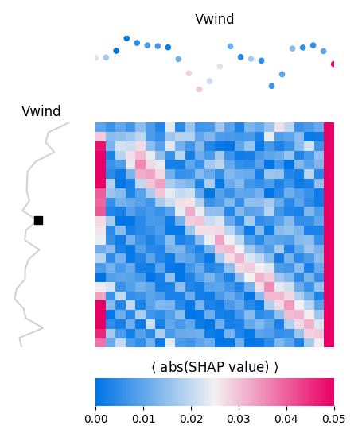

# forecasting_renewables

**Time series forecasting for wind and solar energy with automated neural network model selection**

  
  

---

## Overview

This repository contains the code I developed for the paper  
**“Towards Automated Model Selection for Wind Speed and Solar Irradiance Forecasting”**, published in *Sensors* (2024).  
The article is available [here (PDF)](https://pmc.ncbi.nlm.nih.gov/articles/PMC11314810/pdf/sensors-24-05035.pdf).

This work demonstrates a **comprehensive forecasting pipeline** for wind and solar energy generation, focusing on:

- A **diverse model bucket** combining neural networks, gradient boosting, and linear models  
- A **rigorous, leakage-free cross-validation protocol** for time series  
- **Automated model selection** based on cross-validated performance  
- **Feature importance analysis** for interpretability using SHAP values  

---

## CV Protocol (Rolling Origin Cross-Validation)

The cross-validation framework follows a *rolling origin* design, aligned with the evaluation methodology from the paper:

1. Reserve the **last 10% of the time series** as a final hold-out test set  
2. Apply **5-fold rolling-origin cross-validation**:
   - The training window grows with each fold
   - The validation window is fixed and shifts forward in time
   - The remaining future data in each fold is discarded to prevent look-ahead bias  
3. Within each fold:
   - Models are trained on the training segment
   - Early stopping is performed on a separate validation subset
   - Testing is done on a temporally consistent holdout window  
4. Preprocessing steps such as **normalization and smoothing** are applied independently within each fold to avoid data leakage  
5. Evaluation uses MAE and RMSE, aggregated over folds for model comparison  

This protocol enables robust model evaluation while maintaining temporal integrity.

---

## Automated Model Selection

All models in the candidate pool are evaluated under the same ROCV procedure. Selection proceeds as follows:

- Performance metrics are computed and aggregated across folds  
- Each model configuration (including hyperparameters) is assessed on average validation performance  
- The **best-performing model** is automatically selected  
- Final performance is then reported on the unseen test set  
- The selected model is passed to downstream explainability analysis

---

## Model Bucket

| Model Type          | Examples                                  |
|---------------------|-------------------------------------------|
| Neural Networks     | LSTM, WaveNet (with early stopping)       |
| Gradient Boosting   | LightGBM                                  |
| Linear Regression   | Baseline autoregressive models            |
| Hybrid / Others     | Lomb–Scargle for detrending + regression  |

This range supports comparative evaluation across classic statistical models and more expressive architectures.

---

## Feature Importance Analysis (SHAP)

Once the optimal model is selected, the pipeline includes a step for model interpretation:

- **SHAP values** are computed (via TreeExplainer or DeepExplainer, depending on model type)  
- The contribution of each feature, particularly time-lagged variables, is analyzed  
- Plots highlight which historical inputs most influence future predictions  
- This improves model transparency and aids domain understanding

---

If you use this code or methodology, please cite the original publication:

Blazakis, K.; Schetakis, N.; Bonfini, P.; Stavrakakis, K.; Karapidakis, E.; Katsigiannis, Y.  
*Towards Automated Model Selection for Wind Speed and Solar Irradiance Forecasting*.  
**Sensors** 2024, **24**(15), 5035. :contentReference[oaicite:1]{index=1}

